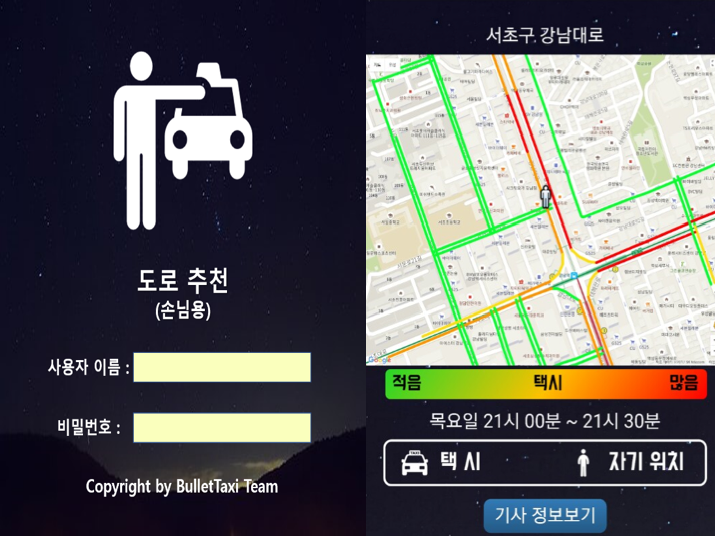
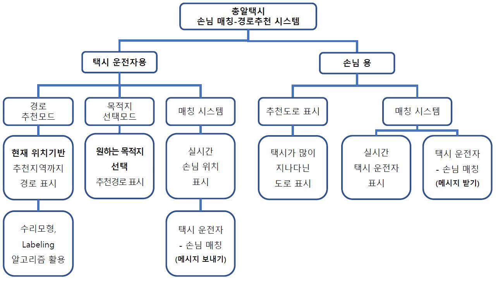
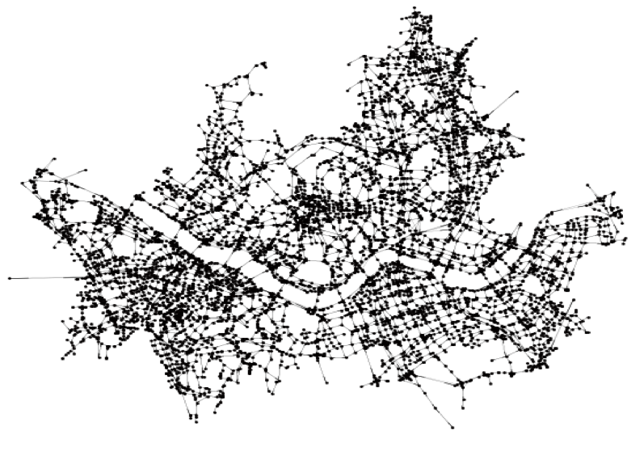
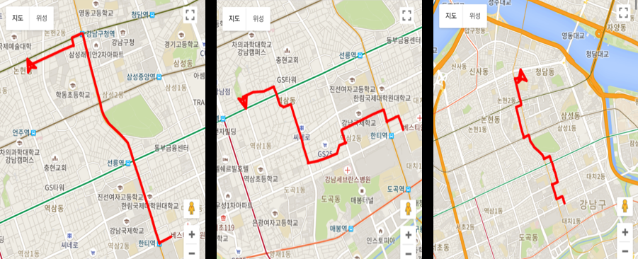

# 2017_Recommend_System_for_Taxi_Driver

We've done this project with Mathematical Programming and Graph Algorithm.

below is the Dataset provided by Korea-Seoul public data_control_center National Transport Information Center.

    https://data.seoul.go.kr/dataList/datasetView.do?infId=OA-12066&srvType=F&serviceKind=1&currentPageNo=1&searchValue=&searchKey=null
    
    http://its.go.kr/itsinfo/snl.do

UI TAXI

UI USER

MAP

PATH
